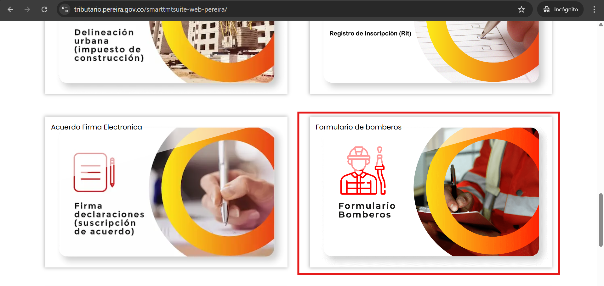
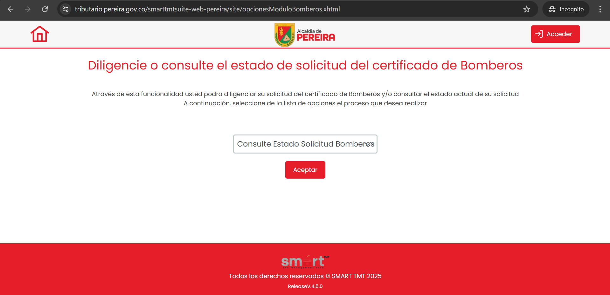
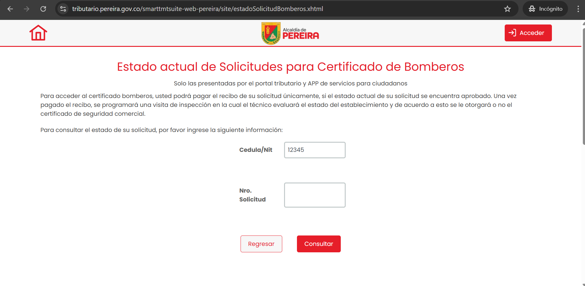
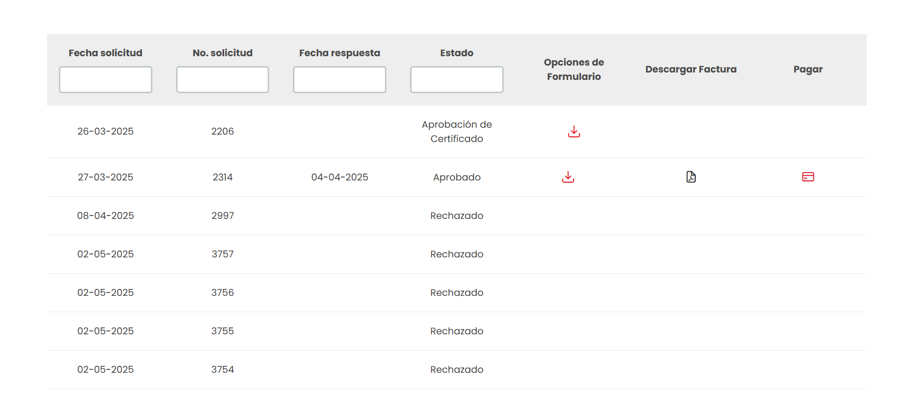

## Paso 1: Acceder al Portal

Para consultar el estado de tu solicitud de certificado de bomberos, primero debes acceder al portal tributario y hacer clic en la tarjeta de **"Formulario Bomberos"** como se muestra en la siguiente imagen:

## Paso 2: Seleccionar el Tipo de Trámite

Una vez en la sección de **"Formulario Bomberos"**, se muestra una pantalla que te permite elegir el tipo de trámite que deseas realizar, ya sea consultar una solicitud existente, iniciar una nueva o validar certificados mediante un campo de selección. En la siguiente imagen se muestra un ejemplo de cómo se ve esta pantalla:

## Paso 3: Consultar el Estado de la Solicitud

Una vez que hayas seleccionado el tipo de trámite, podrás consultar las solicitudes existentes proporcionando tu número de documento o número de solicitud según el campo por el cual deseas filtrar como se muestra en la siguiente imagen.

Busca la solicitud de certificado de bomberos que deseas consultar y haz clic en ella para ver los detalles. En esta pantalla podrás consultar el estado actual de tu solicitud, así como la fecha en que fue presentada, la fecha de respuesta, el código de seguimiento, opciones de formulario, descargar comprobante y la opción de pagar por la generación del certificado. En la siguiente imagen se muestra un ejemplo de cómo se ve la lista de solicitudes:

De esta manera, podrás consultar el estado de tu solicitud de certificado de bomberos de forma sencilla y rápida.