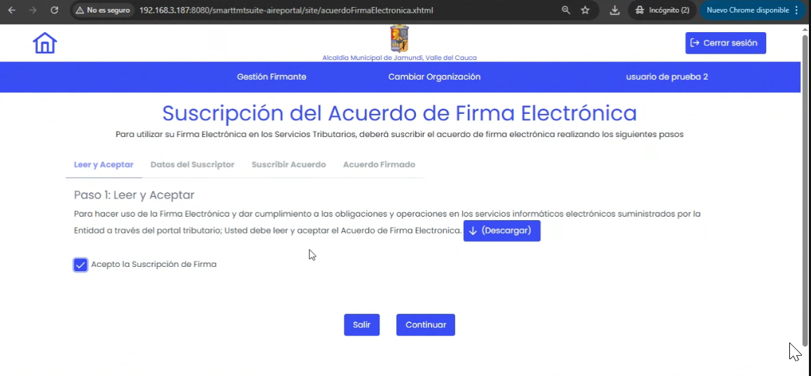
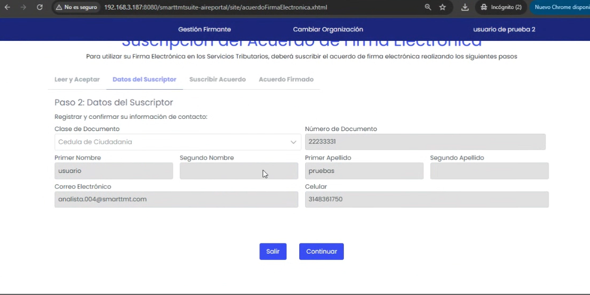
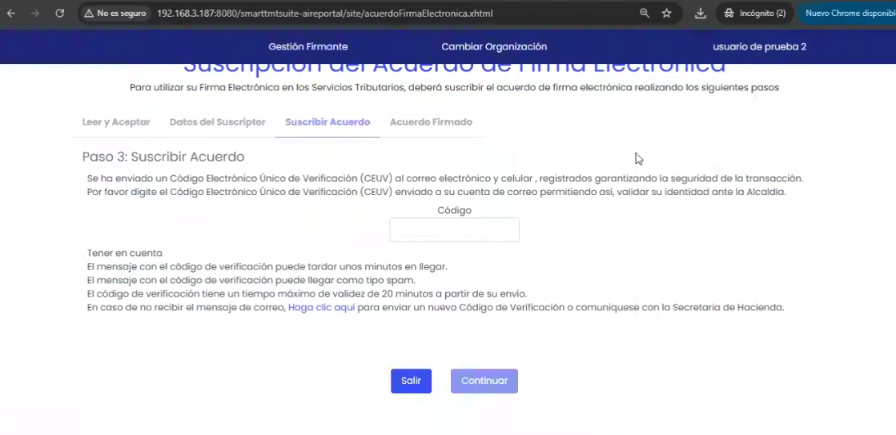
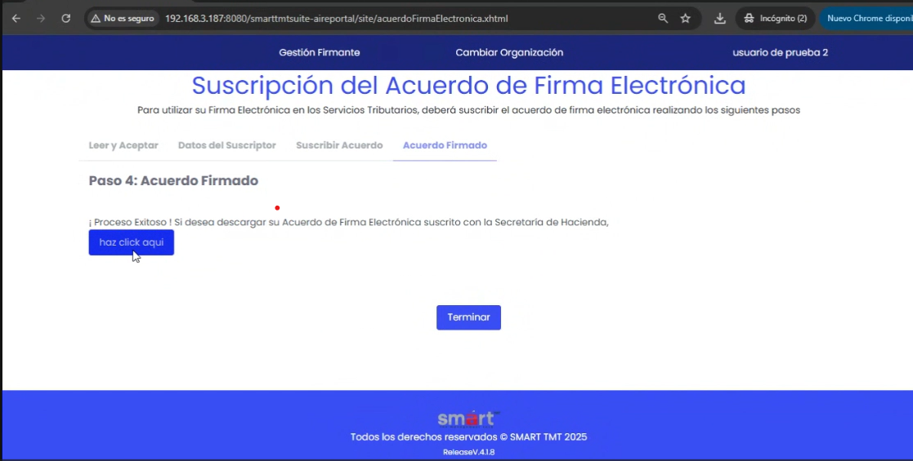

## Paso 1: Aceptar Términos y Condiciones
Para habilitar la firma electrónica, primero debes aceptar los términos y condiciones del servicio. Como se muestra en la siguiente imagen, debes hacer clic en el botón **"Aceptar"** para continuar con el proceso de habilitación:

Una vez que hayas aceptado los términos y condiciones, podrás continuar con el siguiente paso, que es la verificación de tu identidad.

## Paso 2: Verificar Datos del Suscriptor
En esta etapa, se muestra una pantalla donde se muestran los datos del suscriptor. Debes seleccionar el tipo de tu documento de identidad y hacer clic en el botón **"continuar"**. Esto es necesario para confirmar que los datos ingresados son correctos y están actualizados. A continuación, se muestra una imagen que ilustra este paso:

Si necesitas actualizar tus datos debes acceder a la sección de **"Perfil de Usuario"** dentro del portal tributario y realizar las modificaciones necesarias antes de pasar al siguiente paso.

## Paso 3: Habilitar la Firma Electrónica
Una vez que tus datos han sido verificados y están actualizados, el sistema te enviará un código de verificación a tu correo electrónico. Debes ingresar este código en el campo correspondiente para completar el proceso de habilitación. En la siguiente imagen se muestra el campo donde debes ingresar el código:

Con el código ingresado, haz clic en el botón **"Confirmar"** para finalizar el proceso. Una vez que hayas completado estos pasos, tu firma electrónica estará habilitada y podrás utilizarla para firmar documentos digitalmente dentro del portal tributario.

## Paso 4: Descarga del Comprobante
Una vez que tu firma electrónica esté habilitada, podrás descargar un comprobante que lo confirme. Este comprobante es importante, ya que lo necesitarás para futuros trámites. Para descargarlo, haz clic en el boton **"Haz clic aquí"**. Para salir de esta pantalla, simplemente cierra la pestaña, haz clic en el botón **"Terminado"**. Lo cual redirecciona a la pagina de inicio del servicio de firma electrónica. A continuación, se muestra una imagen que ilustra este paso:

