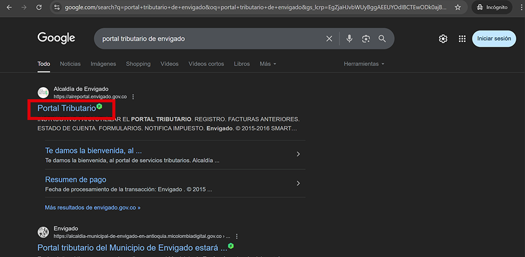
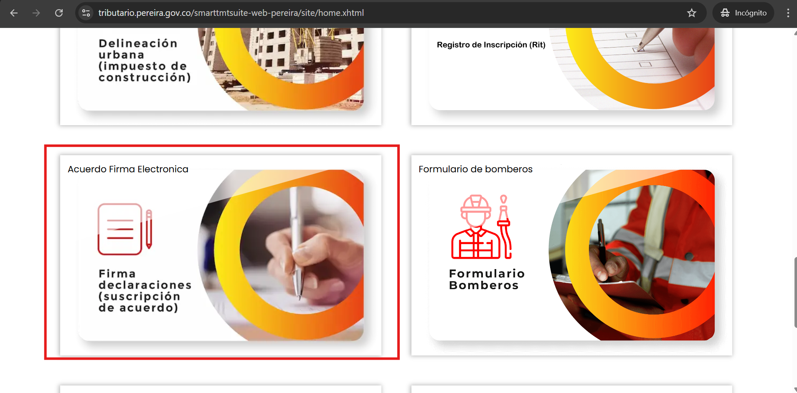
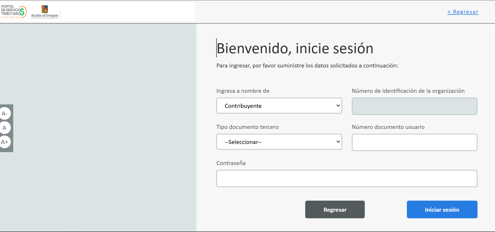
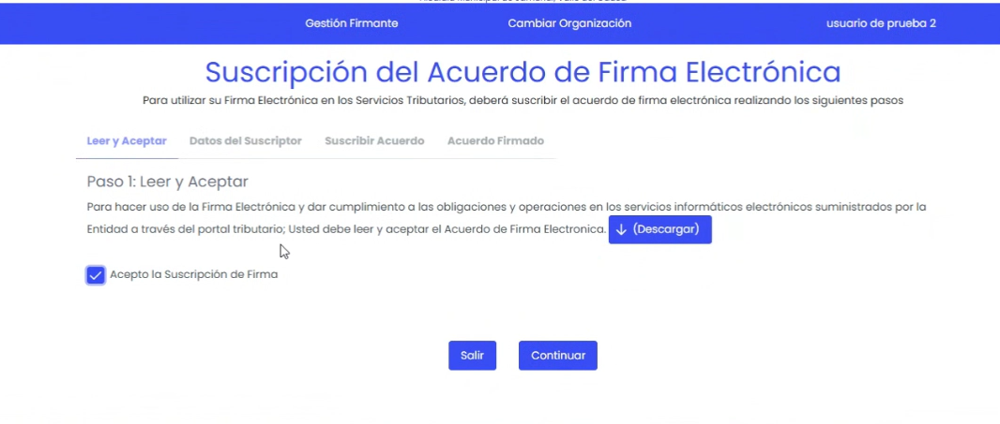
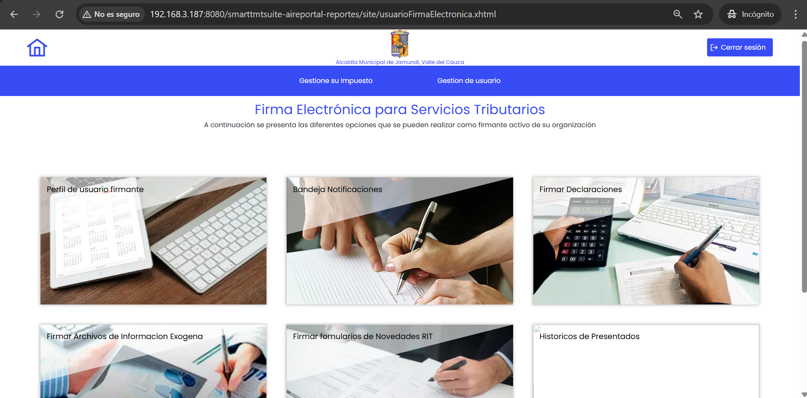

Para ingresar al servicio de firma electrónica, debes seguir los siguientes pasos:
## Paso 1: Acceso al Portal Tributario
Accede al portal tributario de la ciudad o municipio correspondiente. Puedes hacerlo abriendo tu navegador y buscando **"portal tributario de [nombre de la alcaldía o institución correspondiente]"**. Haz clic en el primer resultado que aparece. A continuación, se muestra una imagen que ilustra cómo realizar este proceso:

## Paso 2: Ingreso al Servicio de Firma Electrónica 

Una vez que estés en el portal tributario, busca la opción de **"Acuerdo Firma Electrónica"** en el menú principal. Haz clic en esta opción para acceder al servicio de firma electrónica como se muestra en la siguiente imagen:

## Paso 3: Iniciar Sesión

En la pantalla de inicio de sesión, ingresa tus credenciales (usuario y contraseña) en los campos correspondientes. Luego, haz clic en el botón **"Iniciar Sesión"** para acceder al servicio de firma electrónica. A continuación, se muestra una imagen que ilustra este paso:

## Paso 4: Acceso al Servicio de Firma Electrónica
Una vez que hayas iniciado sesión, serás redirigido al servicio de firma electrónica. Debes visualizar la pantalla de firma electrónica, donde podrás iniciar el proceso para gestionar tu firma electrónica si es necesario. A continuación, se muestra una imagen que ilustra esta pantalla:

Si ya tienes una firma electrónica registrada, podrás utilizarla para firmar documentos como por ejemplo declaraciones de manera digital. Además, puedes revisar el historial de tus firmas electrónicas, también puedes revisar y gestionar tus notificaciones, y adcional a esto puedes gestionar tus datos como tu información personal y de contacto. Si no tienes una firma electrónica, sigue las instrucciones en pantalla para crear una nueva. en la siguiente imagen se muestra un ejemplo de cómo se ve la pantalla de firma electrónica:
