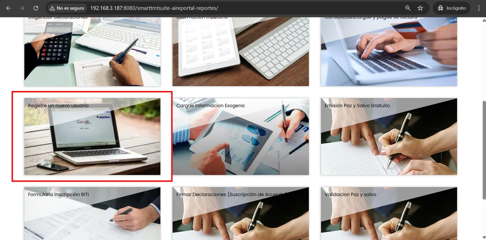
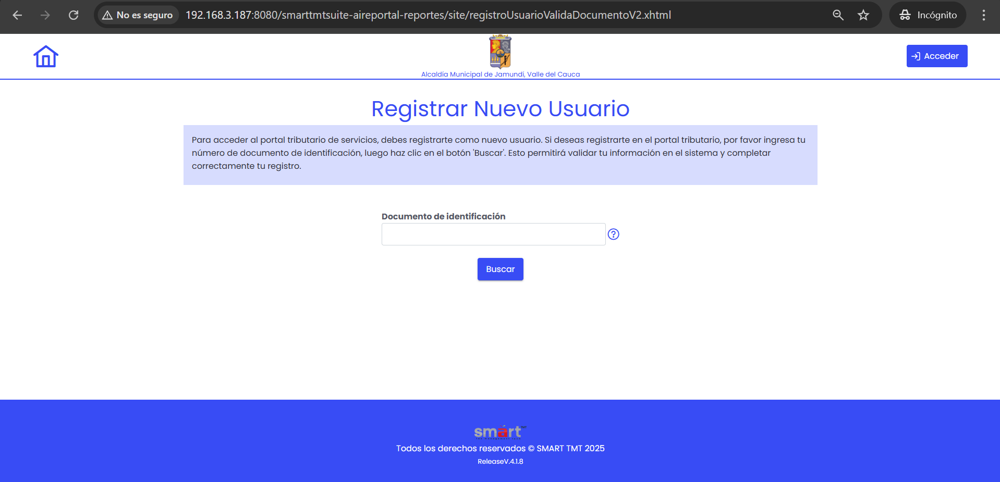

Para registrar un usuario en el portal tributario, es necesario seguir un proceso de verificación mediante su documento de identidad. A continuación, se detallan los pasos a seguir:

## Paso 1: Acceder al Portal
Accede al portal tributario de tu ciudad y busca el servicio de Registro de Usuarios y haz clic en **"Registre un nuevo usuario"**, como se muestra en la imagen a continuación:

## Paso 2: Validar Documento de Identidad

Una vez dentro aparecerá una pantalla como la que se muestra a continuación, en la que debes ingresar tu número de documento de identidad.

Cuando hayas proporcionado tu número de documento de identidad haz clic en **"Buscar"**, el sistema procederá a validar la información. Esto puede tardar algunos minutos.

Sin embargo, se debe tener en cuenta los siguientes puntos antes de continuar con el proceso de registro:

1. Asegúrate de que el número de documento ingresado sea correcto y esté vigente.
2. Ya seas persona natural o jurídica, asegúrate de estar inscrito en el Registro de Información Tributaria (RIT). De no estar inscrito, debes acudir a la entidad correspondiente para realizar el registro.
3. Ten a mano cualquier documento de respaldo que pueda ser requerido durante el proceso de registro.

Una vez se haya verificado tu información dentro del portal tributario, podrás proceder a registrar los datos de tu usuario:

## Paso 3: Acceder y Completar el Formulario de Registro
Accede al formulario de registro de usuarios dentro del portal tributario proporcionando los siguientes datos:

- Número de teléfono
- Correo electrónico
- Contraseña, la cual debe tener entre 8 y 10 caracteres, incluir al menos una letra mayúscula, una letra minúscula y un número.
- Confirmación de la contraseña.

Cuando hayas completado todos los campos, busca la opción **"Registrarse"** y haz clic en ella, como se muestra en la imagen a continuación:

## Paso 4: Revisar y Confirmar
Antes de enviar el formulario, revisa toda la información ingresada para asegurarte de que sea correcta. Una vez verificado, confirma el envío del formulario.

## Paso 5: Esperar la Validación
Después de enviar el formulario, deberás esperar a que el sistema valide tus datos. Este proceso puede tardar algunos minutos. Recibirás una notificación una vez que tu registro haya sido aprobado en tu correo electrónico, el cual contiene un enlace con una pantalla de bienvenida.
